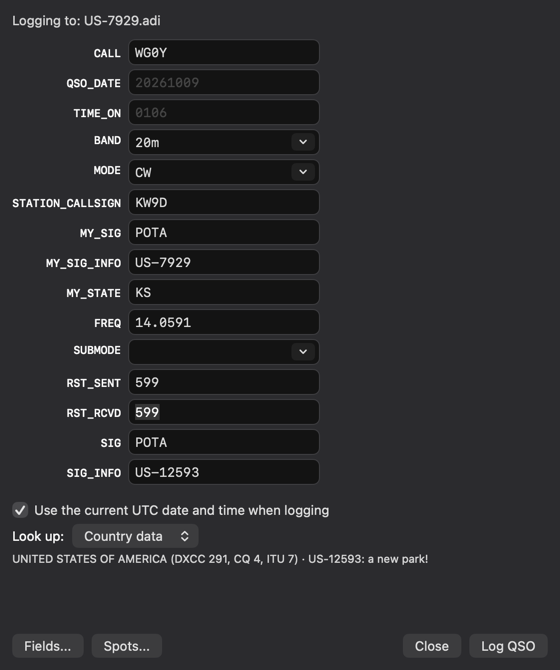
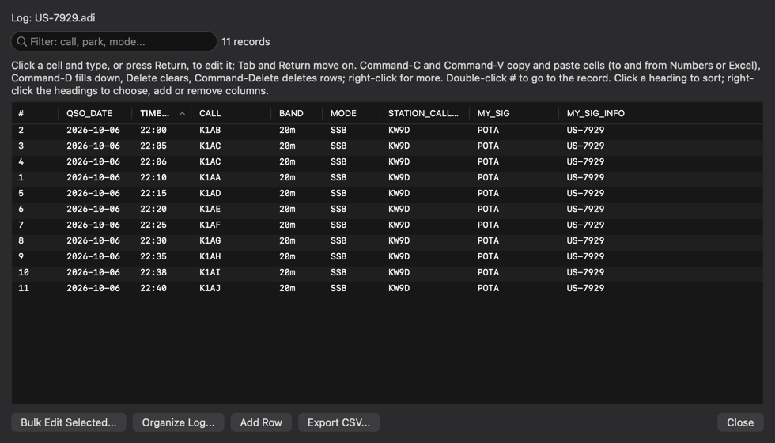
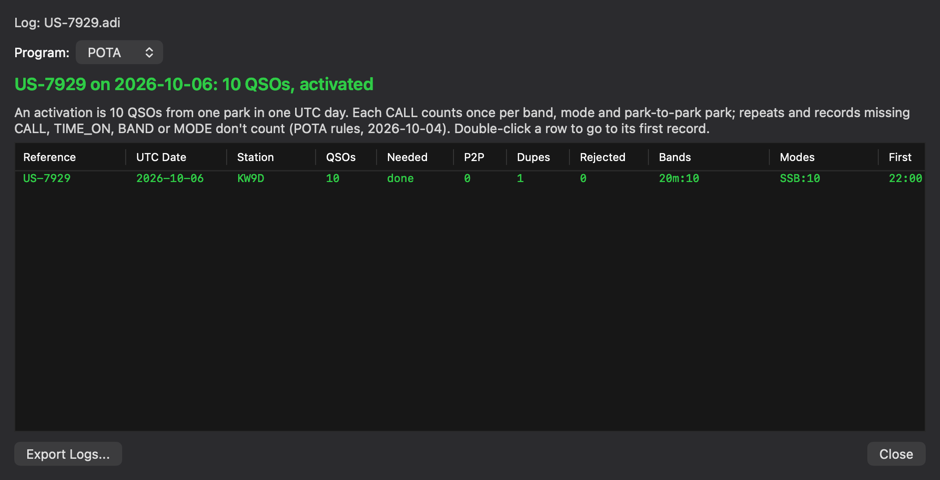
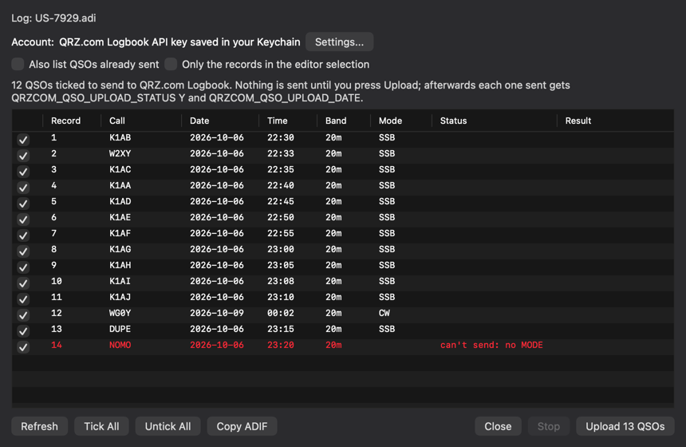

# ADIF Lint for Nextpad++ (macOS)

ADIF Lint is a [Nextpad++](https://nextpad.org) plugin for amateur-radio logs in
[ADIF 3.1.7](https://www.adif.org/317/ADIF_317.htm) ADI format (`.adi`, `.adif`). It checks
a log as you type and repairs its data lengths, and it adds what you need around a log:
logging contacts, tools for POTA, WWFF and SOTA activations, importing your QSOs and
confirmations from LoTW, QRZ.com and eQSL, filling in missing details from callbooks, and
uploading to QRZ.com, LoTW, Club Log and eQSL.

Hand-editing an ADI file is risky: every field is written `<NAME:LENGTH>data`, so
changing `W1AW` to `W1AW/P` without changing `4` to `6` silently truncates the call, and a
length that is too long swallows the next field. Most programs that import the file
don't report either mistake. ADIF Lint marks them as you type and fixes them in one step.

ADIF Lint is free software under the [GNU GPL v3](LICENSE). It is an independent project,
not affiliated with or endorsed by the Nextpad++ or Notepad++ projects.

| New QSO, filled from a POTA spot | Log Table |
|---|---|
|  |  |
| **Activation Tracker** | **Upload to QRZ.com Logbook** |
|  |  |

*Screenshots from the test suite, with sample data.*

## Features

**Checking and repairing**
- Problems marked as you type, checked against the ADIF 3.1.7 specification: data lengths,
  structure, field names, data types, enumerations (BAND, MODE and SUBMODE, QSL statuses,
  STATE for the DXCC entity…), FREQ against BAND, user-defined and `APP_` fields. Hover a
  mark to read why.
- **Fix Lengths** corrects every wrong `<FIELD:LENGTH>` in one undo step.
- Syntax colouring, **Reformat** (one record or one field per line, without touching any
  data), autocomplete of field names and values with automatic lengths, and a docked
  **Record Panel** for editing the record at the caret.

**Logging**
- **New QSO**: log contacts one after another, with your station's fields carried over,
  UTC date and time, live checks and duplicate warnings that follow POTA's park-to-park
  rule.
- Callsign lookup as you type: country, zones and continent offline, or name, QTH and grid
  from QRZ.com or HamQTH, with distance and bearing and what your logs say about the park.
- POTA and WWFF spots, marked NEW when the park or reference isn't in your logs; pick one
  to fill New QSO.

**Log tools**
- A sortable, filterable, editable **Log Table**, a **Log Summary**, and **Worked Before**
  across a folder of logs.
- **Activation Tracker** for POTA, WWFF and SOTA, each with its own rule, and **Export
  Activation Logs** with each program's file names.
- **Sort and Organize**: sort the records by any fields (e.g. band, then call, then date),
  each ascending or descending, and give every record the same field order, without
  changing any data. The Log Table's **Organize Log…** starts from the table's sort and
  columns.
- **Bulk Edit**, **Time Shift** (local time to UTC and back, daylight saving included),
  **Remove Duplicates** and **Merge Another Log**, each previewed before it changes
  anything.
- **Import CSV**, **Export CSV** and **Export Cabrillo**.

**Online services**
- **Import** your QSOs from LoTW, QRZ.com Logbook or eQSL: QSOs the log lacks are added,
  and the ones it has gain the site's confirmation and the details that come with it,
  after you review every change.
- **Enrich** missing fields from QRZ.com, HamQTH or offline country data.
- **Upload** to QRZ.com Logbook, LoTW (through TQSL), Club Log and eQSL. Each window lists
  exactly what would be sent, nothing is sent until you press Upload, and the ADIF
  upload-status fields are kept up to date.
- Accounts are kept only in your macOS Keychain.

**Command line**
- `adiflint` runs the same checks and log tools in a terminal.

Every window and option is described in the [user guide](docs/USER_GUIDE.md).

## Requirements

- macOS 11 or later, on Apple silicon or Intel (the plugin is universal).
- Nextpad++ for Mac 1.1.2 or later.
- Optional: TQSL for LoTW uploads, and accounts with the online services you use.

## Install

**From a release.** Download `ADIFLintvX.Y.Z.zip` from
[Releases](https://github.com/ssamjung2/Nextpad_plus_plus_ADIFLint/releases), unzip it,
move the `ADIFLint` folder into `~/Library/Application Support/Nextpad++/plugins/`, and
restart Nextpad++. The release is ad-hoc signed, not notarized. If Nextpad++ won't load it
after a browser download, clear the download's quarantine flag:

```bash
xattr -dr com.apple.quarantine ~/Library/Application\ Support/Nextpad++/plugins/ADIFLint
```

**From Plugins Admin.** ADIF Lint is not yet in the Nextpad++ plugin list. Once it is, it
will install from **Plugins → Plugins Admin**.

**From source.** With the Xcode command-line tools and CMake 3.20 or later:

```bash
cmake -B build -DCMAKE_BUILD_TYPE=Release
```

```bash
cmake --build build -j
```

```bash
cmake --install build
```

The install step copies the plugin into the folder above. It writes a new file and renames
it into place, so it is safe while Nextpad++ is running; restart Nextpad++ to load it.

To uninstall, quit Nextpad++ and delete the `ADIFLint` folder.

## Getting started

1. Open an `.adi` file. Problems are marked within half a second; rest the mouse on a mark
   to read it.
2. **Plugins → ADIF Lint → Fix Lengths** repairs the lengths. **Validate Now** shows a
   summary.
3. **New QSO…** starts logging.
4. To use an online service, add your account in **Settings…** first.

The source repository has [`examples/try-me.adi`](examples/try-me.adi), with one of each
kind of mistake.

## Menu

All commands are under **Plugins → ADIF Lint**. Nextpad++ ignores plugin default
shortcuts, so assign your own in Nextpad++'s Shortcut Mapper.

| Command | Does |
|---|---|
| New QSO… | Log contacts one after another |
| Spots (POTA, WWFF)… | Activators spotted now; pick one to fill New QSO |
| Log Table… | Sortable, filterable, editable table of the log |
| Activation Tracker (POTA, WWFF, SOTA)… | Activations counted by each program's rule |
| Worked Before… | Search a folder of logs for a call |
| Log Summary… | Counts by band, mode, day, entity and park; confirmations and uploads |
| Bulk Edit… | Set, replace, remove or rename a field, or fill DISTANCE, with a preview |
| Time Shift… | Convert times between UTC and a time zone, or shift by a fixed amount |
| Sort Records by Date and Time | Reorder the records by QSO_DATE and TIME_ON |
| Sort and Organize… | Sort the records by any fields, and put every record's fields in one order |
| Remove Duplicates… | Find QSOs logged twice and remove them after review |
| Merge Another Log… | Add another log's QSOs that this one doesn't have |
| Import CSV… | Add a CSV file's rows to the log |
| Import from LoTW… / QRZ.com Logbook… / eQSL… | Download your QSOs: add the ones the log lacks, confirm the ones it has |
| Export CSV… / Export Activation Logs… / Export Cabrillo… | Save as CSV, as POTA, WWFF or SOTA upload files, or as a Cabrillo contest log |
| Upload to QRZ.com Logbook… / LoTW (TQSL)… / Club Log… / eQSL… | List what would be sent, upload when you say so, mark it uploaded |
| Enrich from QRZ.com… / HamQTH… | Fill missing station details from a callbook |
| Enrich from Country Data… | Fill DXCC, country, zones and continent from the call's prefix, offline |
| Validate Now | Check the current document and show a summary |
| Fix Lengths | Correct every data length |
| Next Problem / Previous Problem | Move between marks |
| Reformat: One Record per Line / One Field per Line | Re-lay the file without touching data |
| Record Panel | Show or hide the docked record table |
| Validate .adi Files While Typing | Problem marks as you type (on by default) |
| Colour ADIF Syntax | Syntax colouring (on by default) |
| Autocomplete Field Names and Values | `<` lists and automatic lengths (on by default) |
| Count Lengths in Characters | Count lengths in UTF-8 characters instead of bytes |
| Settings… | Country data, and accounts for the online services |
| About ADIF Lint… | Version, licence and links |

Every command that changes the log is one undo step, and nothing is saved until you save
the file.

## Privacy and network

ADIF Lint only goes online when you use a command that needs it, and every request uses
HTTPS.

| Service | Address | When | What is sent |
|---|---|---|---|
| QRZ.com XML | `xmldata.qrz.com` | Enrich from QRZ.com; New QSO lookup set to QRZ.com; Test Sign-In | Your username and password (POST), then the calls looked up |
| HamQTH | `www.hamqth.com` | Enrich from HamQTH; New QSO lookup set to HamQTH; Test Sign-In | Your username and password, then the calls looked up |
| LoTW | `lotw.arrl.org` | Import from LoTW; Test Sign-In | Your username and password and the log's date range |
| QRZ.com Logbook | `logbook.qrz.com` | Upload; Import from QRZ.com Logbook; Test Sign-In | Your API key, the log's date range and the QSOs you upload |
| Club Log | `clublog.org` | Upload to Club Log | Your email, Application Password, API key and the QSOs you upload |
| eQSL | `www.eqsl.cc` | Upload to eQSL; Import from eQSL | Your username and password, the log's date range and the QSOs you upload |
| POTA | `api.pota.app` | The Spots window (POTA), every minute while it is open | Nothing but the request |
| WWFF | `spots.wwff.co` | The Spots window (WWFF), every minute while it is open | Nothing but the request |
| Country files | `www.country-files.com` | Settings → Country Data → Update | Nothing but the request |

- **Credentials** are stored only in your macOS Keychain ("ADIF Lint: …" items), never in
  a file, and a saved password is never shown again. HamQTH's sign-in, LoTW's report API
  and eQSL's DownloadInBox take the login in the HTTPS address, as those services document
  it.
- **TQSL** runs on your Mac for LoTW uploads. A certificate password you save is passed on
  its command line, where other programs on your Mac could see it while TQSL runs.
- **Settings** are kept in `ADIFLint.ini` in Nextpad++'s plugin config folder
  (`~/Library/Application Support/Nextpad++/plugins/Config/`).

See [SECURITY.md](SECURITY.md) to report a security problem.

## Command line

`build/adiflint` checks files from a terminal and prints `file:line:column: severity:
message`; the exit status is 1 when there are errors.

```bash
build/adiflint examples/try-me.adi
```

It can also fix lengths, reformat, sort (by date and time or by any fields), put fields in
order, remove duplicates, convert to and from CSV, print the summary, and write Cabrillo or
activation files. `build/adiflint --help` lists the
options, and the [user guide](docs/USER_GUIDE.md#command-line) describes them.

## Building and testing

```bash
cd build && ctest --output-on-failure
```

The tests check every validation rule against the ADIF specification and the official
ADIF test file, fuzz the parsers, and drive the built plugin through every window against
a simulated Nextpad++, with saved sample replies in place of the online services.
[CONTRIBUTING.md](CONTRIBUTING.md) covers the build, the tests, the project layout
and the release steps.

## Limits

- Nextpad++ doesn't let plugins supply a lexer or write to the status bar, so colours are
  painted for the lines on screen, and summaries appear in a tip at the caret.
- Only the active document is checked.
- The online services were tested against saved sample replies, not the live services.
- No SOTA spots: the SOTA API's terms don't allow software written with AI tools without
  the SOTA team's approval. SOTA tracking and export work offline.
- Club Log offers no documented way to download QSOs or confirmations, so there is no
  Import from Club Log. eQSL documents only its InBox (the eQSLs others sent you), so Import
  from eQSL offers the QSOs your log lacks without ticking them: they are the other
  station's records.
- ADX (XML) files are not handled.

The [user guide](docs/USER_GUIDE.md#limits) lists the rest.

## Documentation

- [User guide](docs/USER_GUIDE.md): every window, option and rule.
- [Changelog](CHANGELOG.md): what changed in each version.
- [Contributing](CONTRIBUTING.md): building, testing and releasing.
- [Security](SECURITY.md): reporting a problem, and how your data is handled.

## Licence and credits

ADIF Lint is licensed under the [GNU General Public License v3](LICENSE), the licence of
Nextpad++ and its plugins.

- The validation tables and field descriptions are generated from the
  [ADIF 3.1.7 specification](https://www.adif.org/317/ADIF_317.htm) and its JSON export,
  published by the ADIF Development Group for developers.
- `data/cty.csv` is Jim Reisert AD1C's [Big CTY](https://www.country-files.com/) country
  file, under the MIT licence ([`data/cty-copyright.txt`](data/cty-copyright.txt)).
- `third_party/` holds the Nextpad++ plugin header (GPL v3) and the Scintilla headers
  (Scintilla licence); see [`third_party/README.md`](third_party/README.md).
- HamQTH data is credited in the Enrich window, as HamQTH asks.

Nextpad++ and Notepad++ are the names of their respective projects. QRZ.com, LoTW, Club
Log, eQSL, POTA, WWFF and SOTA are the names of their services and programs; ADIF Lint is
not affiliated with any of them.
